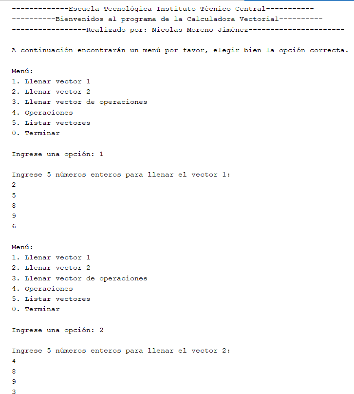
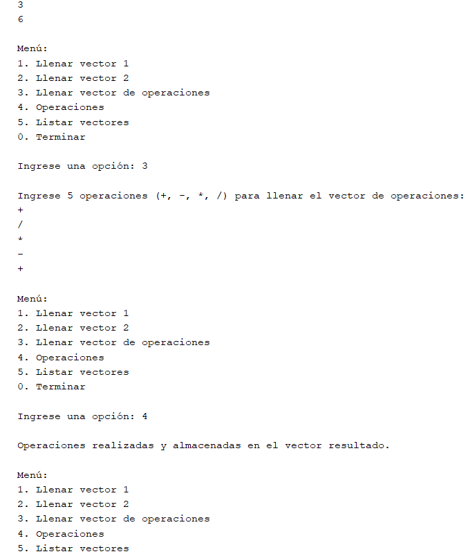
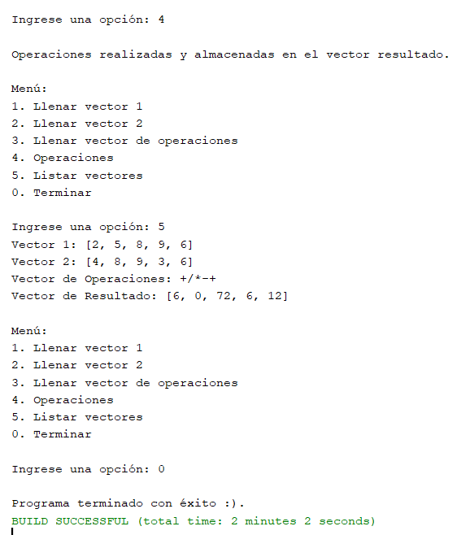

Descripcion
===========
Este es el resultado del código

=================================================================

Resultado

=================================================================

Resultado

=================================================================

Resultado

